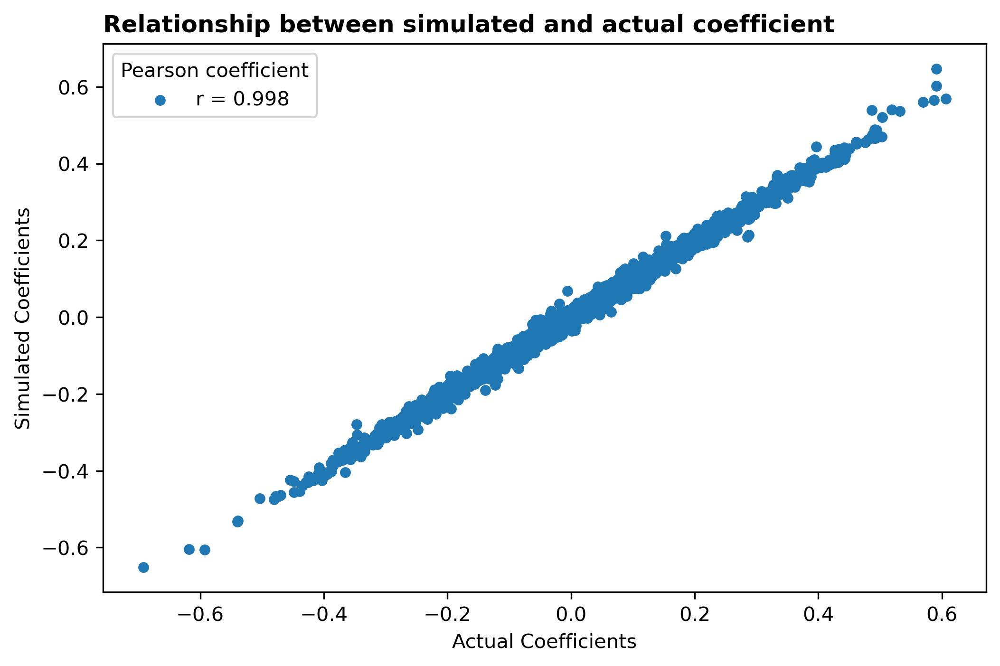
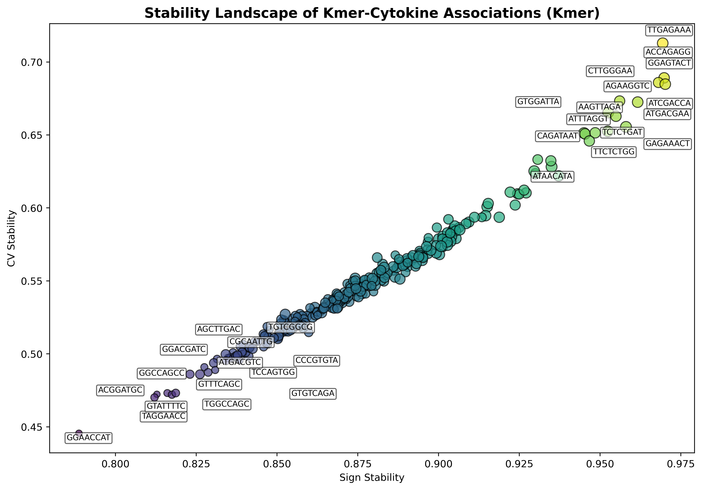
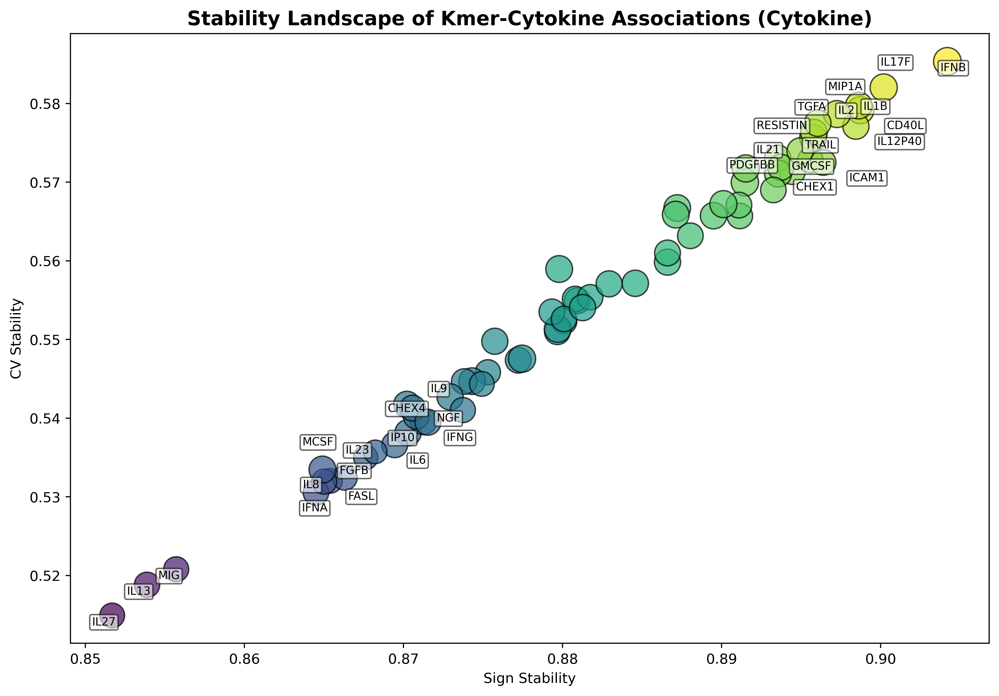
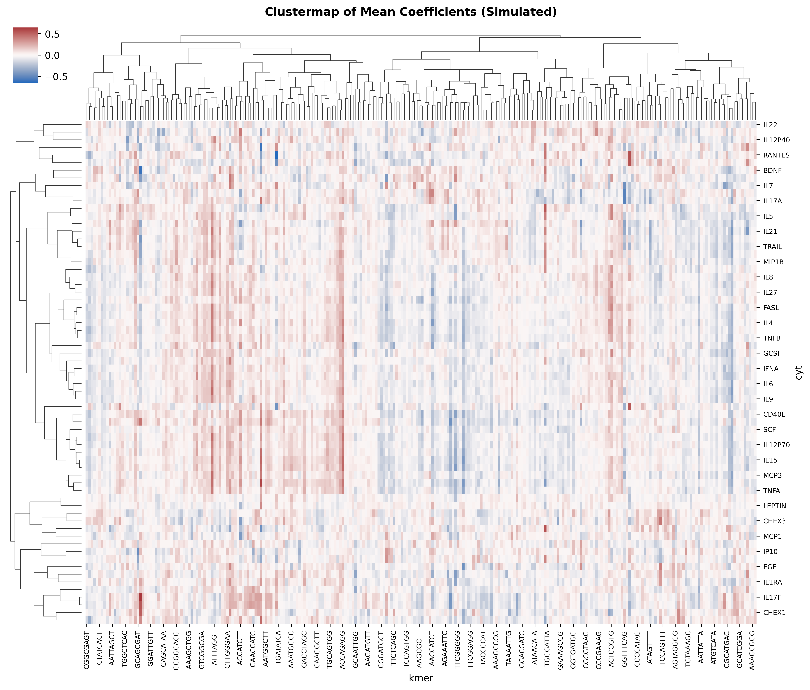
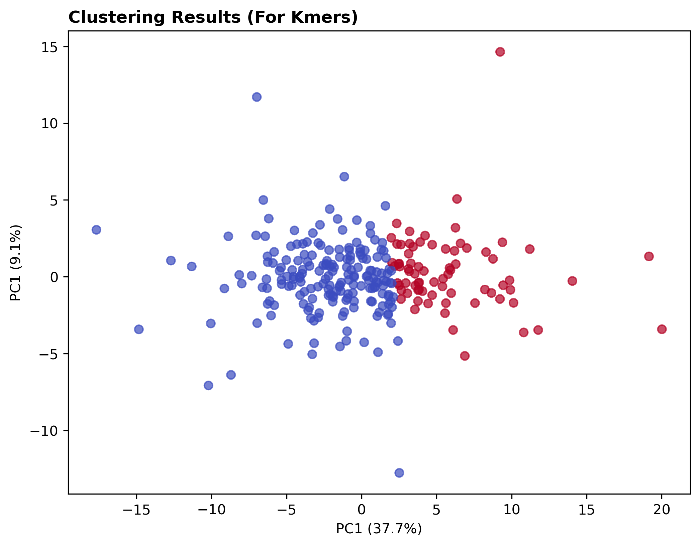
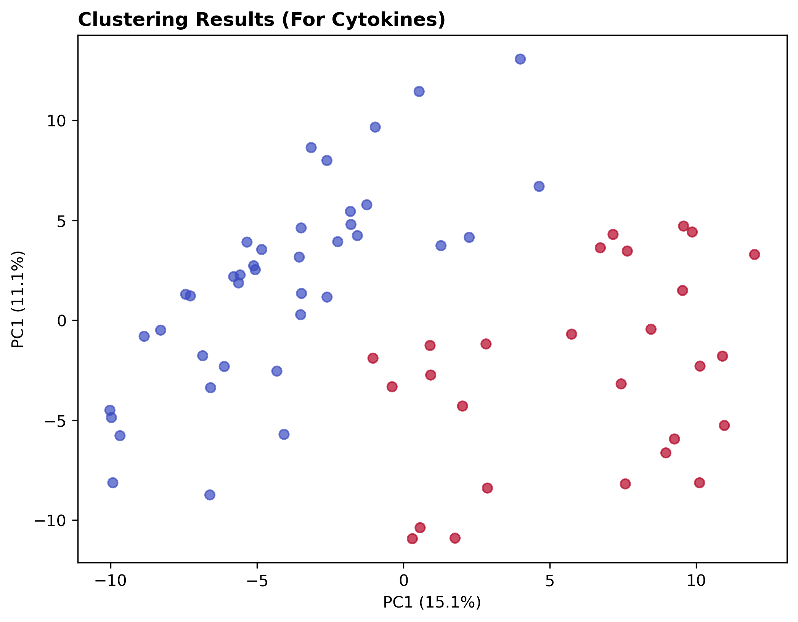

# **Methodology**
The objective of this analysis is to uncover associations between microbial features—specifically kmers—and cytokine levels, and to generate both rankings and confidence scores for these associations. The confidence scores provide an estimate of the range within which the magnitude of a kmer’s effect on a cytokine is likely to fall under repeated sampling. To achieve this, we simulated kmer–cytokine data alongside metabolic and demographic variables—including gender, age, fasting plasma glucose, and body mass index—using the bootstrap method.

Beyond confidence estimation, we assessed the stability of each kmer–cytokine relationship across bootstrap iterations. Stability was evaluated in terms of directional consistency (sign stability) and variability in effect size (coefficient of variation, or CV stability). Initially, we also considered metrics such as top-N frequency and rank of absolute mean coefficients, but these were later excluded due to bias introduced by overlapping kmers and arbitrary thresholds. Ultimately, we computed a composite stability score by combining sign and CV stability through a weighted average. To benchmark the simulated associations, we compared the mean bootstrap coefficients against baseline estimates derived from the original dataset.

## **Data Preparation**
Microbiome data obtained from 16S rRNA and stored in fastq files were cleaned and microbial composition was aggregated by dividing RNA sequences into 8-kmer sequences. The centered log-ratio (CLR) normalisation method was applied to normalise kmer counts to prevent sequence read length and depth bias.

Data cleaning and preparation steps can be summarised as below :-

- Removal of invalid bases (bases with Ns, if present)
- Removal of bases with low quality scores (below 20) and reads with sequence lengths less than 50
- Dividing into 8-kmer sequences, with no successive skips.
- Aggregating them into counts
- Selecting samples with matching cytokine levels.

## **Feature Selection**
To reduce the number of 8-kmer sequences obtained, feature selection methods were applied. Firstly, variance thresholding was applied to drop kmers with very low variance. Next, kmers (1,520) with non-zero coefficients for each cytokine, selected by an elastic-net linear model (in Track 1) were filtered. About 1492 kmers were selected. In track 5, to further reduce the number of kmers, the Spearman's correlation coefficient method was applied by correlating each kmer with each cytokine, and statistically significant ($\alpha$ < 0.05) kmers with $|\rho|$ >= 0.25 were selected. Correlation method and the Spearman's correlation method were selected due to the non-linear relationship ability of the Spearman's correlation and under the assumption that a kmer that associates with a cytokine is capable of eliciting an immune response. Significant kmers were investigated at both the individual body site and across all body sites (system-wide), while significant kmers were selected by investigating kmers across all body sites leaving only 262 significant kmers. For system-wide analysis, CLR-normalised kmer counts were averaged across all body sites. These 262 significant kmers obtained from track 5 were used in this track to find associations between kmers and cytokines.

## **Confidence scores**
The microbial counts and cytokine levels in our dataset represent a sample drawn from a larger population. Similarly, the estimated effect of each microbe on a cytokine is a sample-based approximation of its true effect in the population. To account for uncertainty in these estimates, we used bootstrapping to generate a range of values — a confidence interval — within which the true effect size is likely to fall.

Specifically, we applied a 95% confidence interval, which means that if we were to repeat this sampling process many times, approximately 95% of the resulting intervals would contain the true population mean of the microbe–cytokine association. This approach allowed us to compute lower and upper bounds for each coefficient, providing a statistically grounded estimate of the reliability and precision of each association.

## **Stability scores**
To quantify the reliability of the association between a kmer and a cytokine, we performed various stability metrics to enable us to identify kmers or microbes whose effects are not due to sampling error or spurious relationship. As a result, we computed stability metrics in the bootstraps. These metrics include the following four measures, each capturing a distinct aspect of feature reliability:

### **Sign Stability**
This metric quantifies the proportion of bootstrap iterations in which a kmer’s coefficient retains the same sign (positive or negative). It reflects directional consistency, helping to identify kmers that consistently associate with a cytokine in the same direction across resamples. Features with low sign stability are considered less interpretable and potentially spurious. The maximum of both signs was selected as the most frequent direction of relationship.

### **Coefficient of Variation (CV) Stability**
CV stability is defined as the inverse of the coefficient of variation (standard deviation divided by the absolute mean) of a kmer’s coefficients across bootstraps. It measures the consistency of effect size. Kmers with low CV stability exhibit low variability relative to their average effect, indicating a more reliable association. To ensure values are [0, 1] range, one was added to the cv before computing the reciprocal.

$$
\text{CV} = \frac{\sigma}{|\mu|}
$$

$\text{where } \mu \text{ is the mean coefficient across bootstraps, and } \sigma \text{ is the standard deviation.}$

$$ \text{CV stability} = \frac{1}{1+\text{cv}}$$

### **Top-N Stability** 
This metric captures the frequency with which a kmer ranks among the top N most influential features (based on absolute coefficient magnitude) across bootstrap iterations. It reflects relative importance and helps prioritise kmers that consistently emerge as key contributors to cytokine variation. Here, the top 100 features was selected.

### **Scaled Absolute Mean Coefficient** 
This is the average of the absolute coefficient values across bootstraps, scaled to the 0-1 range. It represents the overall strength of association, independent of direction. Scaling allows for comparability across features and integration with other stability metrics.

Together, these metrics were used to construct a composite stability score, enabling us to rank kmers by both their statistical robustness and biological relevance. This approach allowed us to filter out unstable associations and focus on reproducible microbe–cytokine relationships that are less likely to be driven by sampling noise.

# **Bootstrapping and Modelling**
The bootstrap sampling method was used to generate resamples of the original data. To increase the consistency of result and produce smooth confidence scores, resampling was done 1000 times and used to compute 95% confidence interval scores. Also, to maintain reproducibility and maintain uniqueness of resamples, a pseudorandom number generator was set and each seed was unique in each bootstrap round.

A multivariate penalised linear regression (Ridge) model was used at each resample. This model was used to solve the multicolinearity problem of unpenalised linear regression and on the assumption that a microbe's relationship with a cytokine is linear, where the increase in microbial count similarly activates the immune system thereby increasing the production of cytokines. Another reason is that it is a simple model and the interpretability of the coefficients enables us to quantify the magnitude and direction of a microbe's effect on a cytokine. However, since cytokines are affected by some host factors such as body site, gender, age, and metabolic states like body mass index (BMI) and fasting plasma glucose (FPG), these covariates were included so that the effect of the kmer on a cytokine represents its marginal contribution. Categorical variables were dummy encoded while numerical features like BMI and age were standardised. 

Additionally to ensure that all coefficient values are comparable across kmers and cytokines, we standardised both kmer counts and cytokine values. This transformation allows the interpretation of each coefficient to reflect the expected change in standard deviation units, in a cytokine level resulting from a one standard deviation increase in the corresponding kmer count.

\newpage
# **Results**
To ascertain that the mean coefficients of all resampled data correspond with the actual coefficients from our dataset, we computed the Pearson's (r) correlation between them and plotted the simulated coefficients against the actual coefficients (Figure 1). Our findings show that there's a strong correlation between them, indicating that bootstrapping method is a good estimator of the population mean. 

Next, we wanted to understand the stability landscape of kmer-cytokine associations. We explored this at the kmer and cytokine levels. We focused on the sign stability and the CV stability. For this, we filtered kmers and cytokines with composite score below 0.5 from our simulated result, computed the average composite score, sign stability and CV stability as well as the number of kmers and cytokines (depending on the level of focus) within this range. After that, we visualised in a scatter plot where the CV stability was plotted against the sign stability. The dots were colored by the composite score (in 0-1 range) and the size of the dots by the total number of kmers or cytokines within this composite score cutoff point. After that, the top and least n kmers or cytokines were plotted to the figures. Figures 2 and 3 show the relationship between CV stability and sign stability for kmers-cytokine pairs with composite scores at least 0.5.

\newpage

Here, we see that there are sequence similarities and overlapping sequences between top and least n kmers. The lower sign and CV stability kmers are similar in 4-5 sequences with point mutations in one or more. For instance, from figure 2, we see `GGAACC`, `GGCCAGC` and `GTCGG` sequences in the lower sign-lower CV axis. On the high sign-high CV axis, we see a similar pattern. In Figure 3, we see cytokines like `RESISTIN`, `IL2`, `PDGFBB`, `IFNB`, `ICAM1`, `GMCSF` and `MIP1A` as cytokines with high sign-stable and moderate CV-stable kmers. We could also see that at both kmer and cytokine levels we have very high sign stability. This shows that on the cytokine side, the direction of effect of all kmers on a it is stable at least 85% of the time and on the kmer side, that the kmer's direction of effect on all cytokines is stable at least 77% of the time. Similarly, the sizes of the dots in Figure 3 show that each cytokine almost have a similar set of kmers exerting some influence on it while in Figure 2, we see a similar trend exept in the lower ends of both sign and cv stabilities, we see these kmers affecting smaller amount of cytokines.

\newpage

Next, we visualised the mean coefficient values of the bootstrap datasets in a clustermap using the correlation distance metric and complete linkage method. We aimed at identifying cytokines with similar association profiles and kmers that behave similar across cytokines as these cytokines may share regulatory mechanisms or immune pathways or kmers may share potential microbial signatures (Figure 4). Along the kmer axis, we see possible two clusters that can be formed, where in one half are kmers majorly with positive relationships and the other half, with negative relationships. This was confirmed from the clustering result in Figure 5. On the cytokine axis, two clusters can also be formed, but the points seem to be too disperse from each other (Figure 6).

